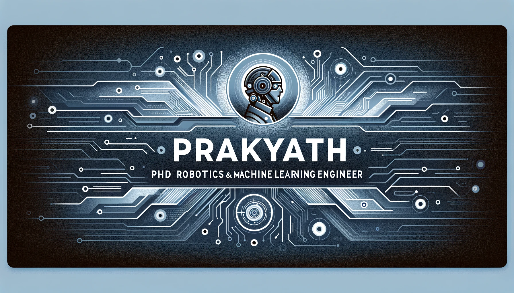
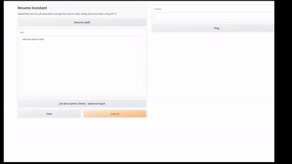
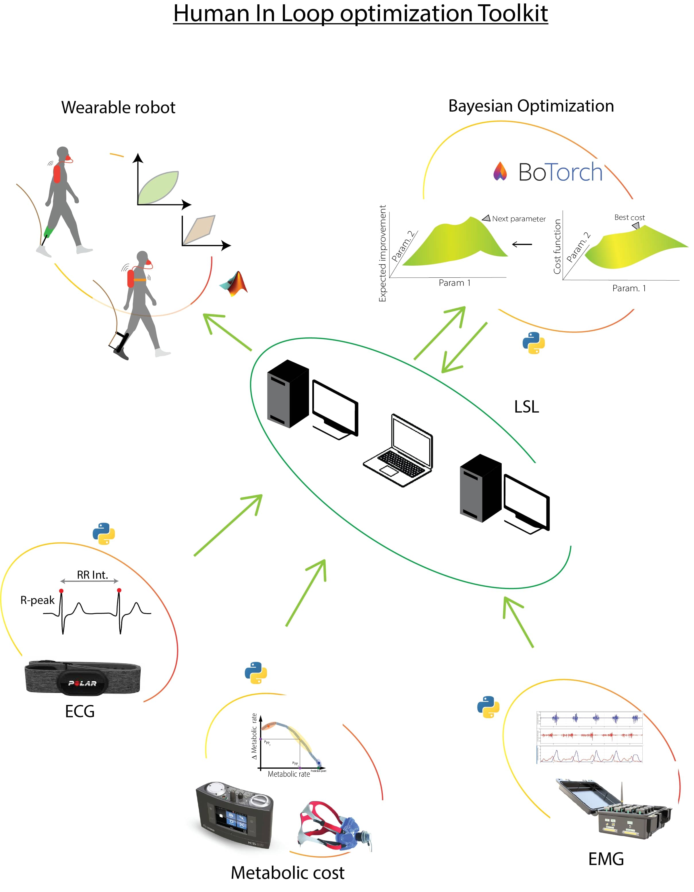
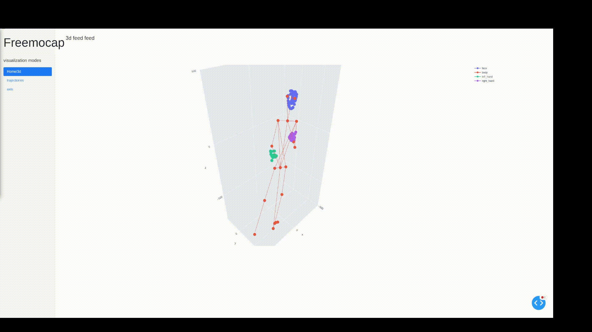

  
  
  
  

# Hello, HI!
 <!-- Profile views -->
 <!--  -->
 
 
 
I am Prakyath Kantharaju!
  
I'm a Robotics and Machine Learning Engineer currently based in Chicago, originally from India. 
My academic journey includes a PhD in wearable health robots, where I specialized in creating AI-powered solutions to improve quality of life.

Beyond my academic pursuits, I have practical experience in applying AI to enterprise-level auto insurance claims, gained through a comprehensive internship. 
This experience has enhanced my expertise in generative AI, reinforcement learning, and wearable robotics.
  
<!--   I am motivated by the power of technology as a tool for positive change, with a background in Math, Physics, and Engineering. -->

 

# Projects 📽 
<!-- <h1 align="center">Projects</h1> -->
<table bordercolor="#66b2b2">
  
  <tr>
    <td width="50%" valign="top">
      <h3 align="center">Fine tune code assistant</h3>
         
        
         
        

           
    
      

        
<strong> LORA, HUGGINGFACE </strong> Fine any causal LM code assistant with any repository using LORA.

    </td>
    <td width="50%" valign="top">
      <h3 align="center"> Resume assistant</h3>
         
      <a target="_blank">
            </img>
        </a>
         
        

    
   
      

        
<strong>OPENAI- API, langchain</strong> Repository for getting personalized resumes and coverletter given job decription

    </td>
  </tr>
  
  <tr>
    <td width="50%" valign="top">
      <h3 align="center">Human In the Loop toolkit</h3>
       
        
       
        

           
  
  
      

        
<strong>Bayesian optimization, pytorch, wearable robots</strong> - Human in the loop optimization for robot personalization.

    </td>
    <td width="50%" valign="top">
      <h3 align="center">Quadruped</h3>
         
        <a target="_blank" href="https://github.com/prakyathkantharaju/Quadruped">
          </img>
        </a>
         
        

           
  
      

        
<strong>Reinforcement learning, pytorch, PPO, Mujoco, quadcopter</strong>Developed and trained custom RL and Vision models applied on quad to walk and follow a path.

    </td>
  </tr>
  
   <tr>
    <td width="50%" valign="top">
      <h3 align="center">Learn to move</h3>
         
        <a target="_blank" href="https://github.com/prakyathkantharaju/learn-to-move">
          </img>
        </a>
         
        

           
  
  
      

        
<strong>Reinforcement learning, pytorch, PPO, Mujoco</strong> Trained walking robots to cross obsiticles using only vision and not sensors

    </td>
    <td width="50%" valign="top">
      <h3 align="center">Motion capture visualization</h3>
         
        
         
        

           
  
      

        
<strong>plotly, HTML, CSS3</strong> Use 3d motion capture and generate a 3d visualization realtime.

    </td>
  </tr>
</table>

# Technologies & Tools 🔧

 

# GitHub Stats 📈
<!-- 

   -->

  

<!--  -->
<!-- 

 

<a href="https://github.com/prakyathkantharaju/Web-Postman">
  

   -->

  
<!--
A sample of my recent articles:

<!- BLOG-POST-LIST:START ->
- [Python f-strings Are More Powerful Than You Might Think](https://bit.ly/3uETfbi)
- [Ultimate CI Pipeline for All of Your Python Projects](https://bit.ly/3MI4Iz0)
- [Optimizing Memory Usage in Python Applications](https://bit.ly/3M30D82)
- [Upcoming Python Features Brought to You by Python Enhancement Proposals](https://bit.ly/3oMJ6qR)
<!- BLOG-POST-LIST:END ->
-->

<!-- links to social media icons -->

<!-- icons with padding -->

[1.1]: http://i.imgur.com/tXSoThF.png (twitter icon with padding)
[2.1]: http://i.imgur.com/0o48UoR.png (github icon with padding)

<!-- icons without padding -->

[1.2]: http://i.imgur.com/wWzX9uB.png (twitter icon without padding)
[2.2]: http://i.imgur.com/9I6NRUm.png (github icon without padding)
[3.2]: https://raw.githubusercontent.com/MartinHeinz/MartinHeinz/master/linkedin-3-16.png (LinkedIn icon without padding)

<!-- links to your social media accounts -->

[1]: https://twitter.com/prakyath_k
[2]: https://github.com/prakyathkantharaju
[3]: https://www.linkedin.com/in/prakyath-kantharaju/

<!-- default README.md -->
<!--
- 👋 Hi, I’m Rahul Karda
- 👀 I’m interested in Full Stack Web Development and other skills
- 🌱 I’m currently learning React
- 💞️ I’m looking to collaborate on different web dev projects
- 📫 How to reach me - You can contact me on rahulkarda2002@gmail.com
-->
  
------
Credit: Prakyath kantharju ( idea borrowed from rahulkarda)
